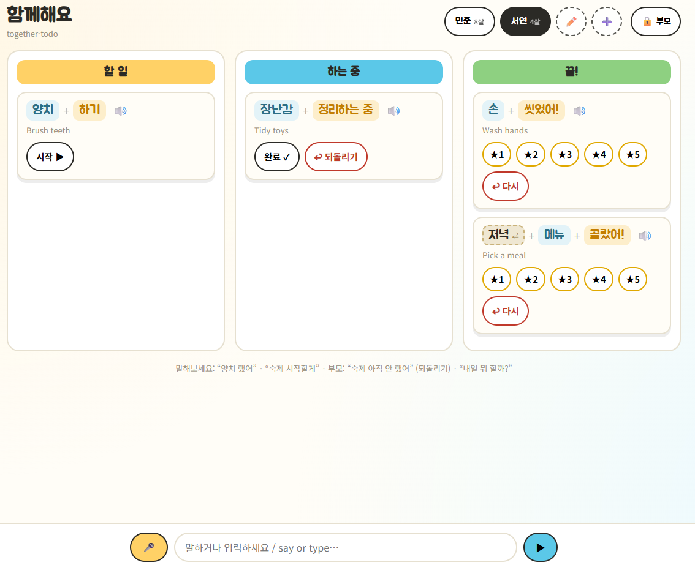
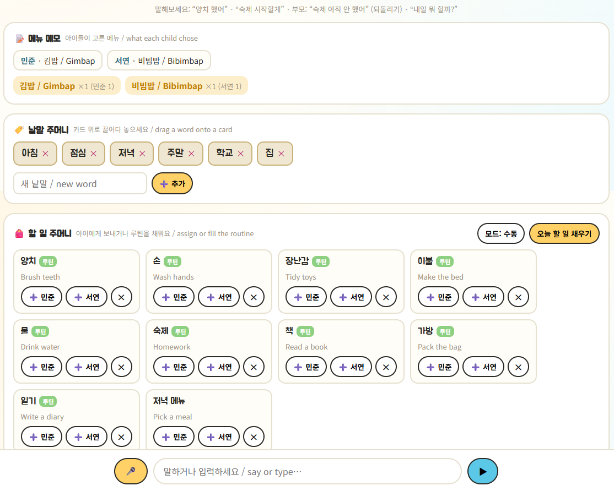
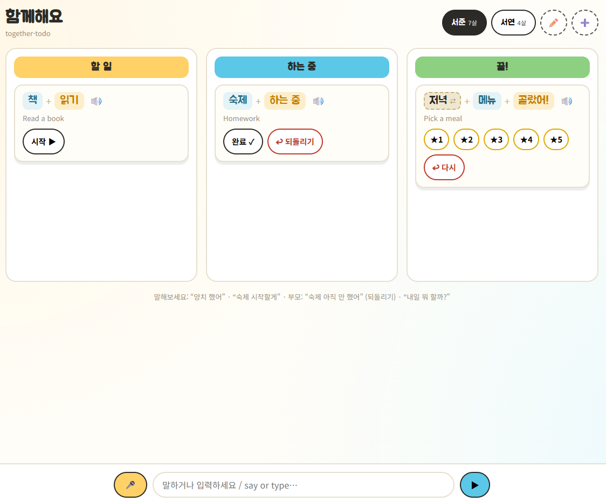

# together-todo — a tool-calling agent sandbox (v3)

A bilingual Korean/English Kanban where a child's message (typed, spoken, or
tapped) is **routed** to a tool that changes the board, plus a **PIN-gated
parent mode** for running the day. Built to internalise one pattern:
**route → dispatch**.

| Kids' board | Parent mode (PIN-gated) |
|---|---|
|  |  |

## What's new in v3 — parent mode

A separate access level for grown-ups. A `🔒 부모` toggle asks for a **PIN**
(default `0000`) and reveals three panels stacked under the board.

| Feature | Where it lives | The idea |
|---|---|---|
| **Parent access level (PIN)** | `parent_auth` in `board.py`, `/parent/verify` | A `role` on every user (`child`/`parent`); the kid switcher shows children only. Parent panels stay hidden until the PIN unlocks them — kids can't wander in. |
| **Task bag (backlog pool)** | `bag` + `bag_*` tools, `/bag*` | A pool of reusable task **templates** parents curate, then assign into a kid's 할 일 with one tap (`➕ 민준 / ➕ 서연`). Seeded with a 10-item daily routine. |
| **Routine: manual *or* auto** | `assign_routine`, `ensure_today`, `settings` | `오늘 할 일 채우기` bulk-fills on demand (manual), or flip to **auto** and weekday routines fill themselves when the board opens. Deduped per day so reopening never piles up. |
| **Word bag (drag-and-drop)** | `word_bag` + `/words`, `set_prefix` tool | Draggable prefix words (아침/점심/저녁/주말/학교/집). Drag one onto **any** card to swap its prefix — `저녁 메뉴 고르기` → `주말 메뉴 고르기` — subject + verb untouched. (Tapping the prefix chip still cycles, for kids.) |
| **Menu-memory notes** | `menu_notes()` + `/notes` | When a kid completes a choice card, parents see who picked what, with prep counts across kids: **비빔밥 ×1 (민준) · 김밥 ×1 (서연)**. |

> Also fixed since v2: an unmatched spoken chore (e.g. `양치 했어` for a kid with
> no 양치 card) now **auto-creates the card in 할 일** instead of erroring;
> prefixes became their own swappable part; and parents can add/edit/delete
> children inline (`➕`/`✏️`).

## What's new in v2

| Feature | Where it lives | The idea |
|---|---|---|
| **Usernames + multiple children** | `board.py` users (with age) | Every card has an `owner`. Two kids (민준 8, 서연 4) seeded with age-appropriate cards. The active child is **context we pass in** — the LLM never picks the child. |
| **Reverse / examine tool** | `reverse_task` + one dispatch row | Parent assessment: "숙제 아직 안 했어" sends a card **back** a column. Adding it was *one function + one enum value + one dispatch row* — exactly the lesson from the architecture diagram. |
| **House glossary** | `GLOSSARY` in `board.py` | Casual phrasing maps to a card. "양치질 했어?" and "양치 했어?" both hit the `양치` card. Extend the dict with your family's terms. |
| **Composable cards (verb recycling + tense)** | `VERBS` table + `parts()` | A card = `prefix + subject + verb`. The verb **conjugates by column**, teaching tense as the card moves: 양치 **하기** → 양치 **하는 중** → 양치 **했어!**. `하다` is recycled across 양치/숙제/정리; the prefix (`저녁`/`아침`) is recycled across 메뉴. Reversing a card rewinds its tense too. |
| **iPad-optimised UI** | `static/index.html` | 48px touch targets, 16px inputs (no iOS zoom), safe-area insets, `viewport-fit=cover`, 3-column landscape grid, horizontal snap-scroll in portrait. Card parts render as coloured **chips** so the recycled pieces and the changing tense are visible. |
| **Korean voice** | Web Speech API | 🔊 reads each card in the **correct tense** for its column; 🎤 voice input is one more channel into the same router. |



## The mental model (unchanged — that's the point)

```
  CHANNELS              ROUTER                  TOOLS
  tap  ─┐
  type ─┼─► router.handle(text, child) ─► register · start · complete
  voice ┘     (shared guardrails)             reverse · rate · predict
```

Add a tool = one `board.py` function + one row in `router._dispatch`. Swap the
brain (`rule_route` ↔ `gemini_route`) or the store (in-memory → MongoDB) and
nothing else changes.

**Parent actions skip the brain.** The bag, word bag, notes and PIN are
deterministic grown-up operations, so they're plain REST endpoints calling the
same `board.py` tools directly (`/tap` already does this for buttons). No
routing, no guardrails needed — there's nothing to interpret.

## Files

| File | Role |
|---|---|
| `board.py` | Users (with `role`), the kid **tools** + parent tools (task **bag**, **word_bag**, `set_prefix`, `menu_notes`, routine fill, PIN), `VERBS` conjugation table, `GLOSSARY`, parts→display/spoken composition, no-ML predictor. |
| `router.py` | `Action` schema, **rule_route** (offline, auto-creates unmatched chores), **gemini_route** (structured output), the **dispatch table**. |
| `cli.py` | Study route→dispatch in the terminal (pick a child, type, watch tense change). |
| `app.py` | FastAPI. Kids: `/board?user=`, `/act`, `/tap`. Users: `GET/POST/PATCH/DELETE /users`. Parent: `/bag*`, `/words`, `/notes`, `/settings`, `/parent/verify`, `/parent/pin`. |
| `static/index.html` | iPad-first board + voice + child switcher, plus PIN-gated parent panels (menu notes · word bag · task bag) and word→card drag-and-drop. |

## Run

```bash
python3 -m venv .venv && source .venv/bin/activate
pip install -r requirements.txt
python cli.py                      # offline, no key — fastest way to learn
uvicorn app:app --reload           # http://localhost:8000
```

Switch the brain to the LLM: put a free [AI Studio key](https://aistudio.google.com/apikey)
in `.env`, set `USE_GEMINI=1`, restart. Same board, same tools.

## Try it

As **서연 (4)**: `양치 했어` · `손 씻을게` · `장난감 정리했어`
As **민준 (8)**: `숙제 다 했어` → then as a **parent**: `숙제 아직 안 했어` (reverse)
Either child: `내일 뭐 할까?` (per-child prediction)
Try a chore with no card yet — `물 마셨어` — it lands in 할 일 automatically.

**As a parent:** tap `🔒 부모`, enter PIN `0000`. Then:
- drag `저녁` from the 낱말 주머니 onto a card to swap its prefix;
- assign a 할 일 주머니 template to a child, or hit `오늘 할 일 채우기` for the whole routine (flip 모드: 수동 ↔ 자동);
- let a child pick a meal, then watch the 메뉴 메모 panel tally it.

MIT.
